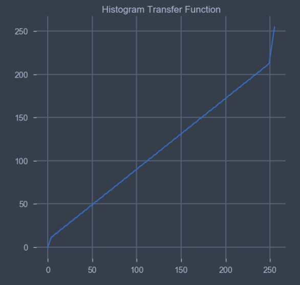

# Single Image Fog Removal Using Bilateral Filter

This github repo consists implementation of this [research paper](https://ieeexplore.ieee.org/document/6224342/)

The code is present in the ipython notebook. You can convert it to python scripts if need arises.

# Sample Outputs

### Estimated and Refined Depth Map

### Output image before Postprocessing

### Post-Processing Transfer Function for histogram stretching

### Final Output

